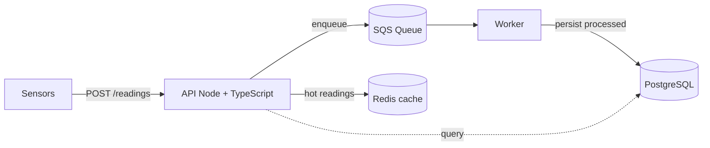

# Event-Driven Machine Telemetry Platform

> Ingestion and processing of telemetry from a fleet of agricultural machines
> (tractors, harvesters), with ingestion decoupled from processing through a queue —
> to absorb traffic spikes and scale horizontally.


🔗 **Live demo:** _(coming soon — Day 10)_ · 🎥 **Walkthrough (3 min):** _(coming soon — Day 13)_

---

## Problem
A fleet of agricultural machines emits thousands of sensor readings (fuel,
temperature, RPM) in bursts. Handling this synchronously does not scale: a spike
can take the API down. This project separates **ingestion** from **processing**
using a queue, so the API stays responsive under load while a worker consumes the
backlog at its own pace.

## Architecture



## Tech Stack

| Layer | Technology |
|---|---|
| API | Node 20 · TypeScript · Fastify · Zod |
| Messaging | AWS SQS (LocalStack in dev) |
| Persistence | PostgreSQL · Redis |
| Frontend (client/demo) | React · Vite · TypeScript |
| Testing | Vitest · React Testing Library · MSW · Playwright |
| Infrastructure | Docker · docker-compose · GitHub Actions |

## Getting Started
**Prerequisites:** Node 20+, Docker.

```bash
git clone https://github.com/OWNER/REPO.git
cd REPO
cp .env.example .env
npm install
docker compose up -d
npm run dev
```

## Testing
This project is built with **TDD** — every piece is driven by a failing test first
(red → green → refactor).

| Level | Tooling | Status |
|---|---|---|
| Unit / Component | Vitest · React Testing Library | 🚧 in progress |
| API mocking | MSW (network-level) | 🚧 in progress |
| Integration | Vitest · `fastify.inject()` · Testcontainers | ⬜ planned (with the backend) |
| E2E | Playwright | ⬜ planned |

```bash
npm run test            # unit/component tests (watch mode)
npm run test -- --run   # single run (CI)
npm run coverage        # coverage report
```

Test pyramid: many unit · some integration · few E2E.

## Status & Roadmap
> Honesty over hype. ✅ done · 🚧 in progress · ⬜ planned

- ✅ Frontend base + project tooling (lint, format)
- 🚧 Contract/types layer + frontend tests (Vitest + RTL + MSW)
- ⬜ REST ingestion API (`POST /readings`) + query endpoints
- ⬜ SQS queue + decoupled worker
- ⬜ Redis cache for hot readings
- ⬜ Integration + E2E tests + green CI
- ⬜ AWS deployment (ECR + Fargate + RDS + SQS)
- ⬜ _Stretch:_ Terraform · OpenTelemetry

## Requirements Coverage

| Job requirement | Where this project proves it |
|---|---|
| Node.js + TypeScript | End-to-end typed REST API |
| Scalable distributed systems | Ingestion decoupled via queue + worker |
| AWS | ECR · Fargate · RDS · SQS (LocalStack in dev) |
| Testing (unit/integration/E2E) | Vitest (unit/integration) · Playwright (E2E) |
| CI/CD | GitHub Actions (lint + test + deploy) |
| _Nice to have:_ IaC / Observability | Terraform · OpenTelemetry (stretch) |

## Technical Decisions
Decisions are recorded in [`/docs/adr/`](docs/adr) — e.g. _why a queue instead of
synchronous processing_, _why ingestion is separated from processing_.

---
_Portfolio project by Luigi Cavalieri — software engineering, event-driven
architecture, and AWS._
